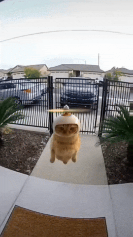

# Abdul

<table border="0" cellspacing="0" cellpadding="0">
  <tr>
    <td></td>
    <td></td>
    <td></td>
  </tr>
  <tr>
    <td></td>
    <td></td>
    <td></td>
  </tr>
  <tr>
    <td></td>
    <td></td>
  </tr>
</table>

currently at [House of EdTech](https://houseofedtech.in/) · building [ccards.co](https://ccards.co) and [spacerep.app](https://spacerep.app)

[blog](https://blog.prasdud.com) · [twitter](https://twitter.com/prasdud) · [linkedin](https://linkedin.com/in/mabdulmuid)

---

> "But perhaps you hate a thing and it is good for you; and perhaps you love a thing and it is bad for you. And God Knows, while you know not."
